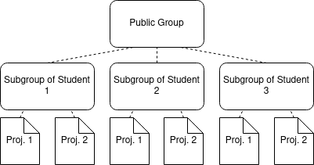

# Plagiarism Detection Tool for FEEC BUT
This tool is designed for the needs of subject BPC-BDS on FEEC BUT.

## Installation

### Prerequisites
- `python3` (Can be checked with `python3 --version`), ideally Python 3.10 or newer. [Here is the download link.](https://www.python.org/downloads/)
  - **Attention:** `python3` command line utility may be called `py` or `python` on Windows**!**
- `pip` (Should be part of `python`, can be checked with `python3 -m pip --version`.)
- `venv` (Should be part of `python`, can be checked with `python3 -m venv --help`.)
- `git` (Can be checked with `git --version`. On Windows install the [`git cli`](https://git-scm.com/downloads) application.)

### Setting Things Up
- `python3 -m venv venv` (Uses package `venv` to create a virtual environment called `venv`.)
- On Linux: `source venv/bin/activate`, on Windows `.\\venv\\Scripts\\activate`
- `python3 -m pip install -r dependencies.txt`
- **Optional:** Fill in the `.env` file to find all necessary projects on GitLab (for online use with GitLab only).
- **Optional:** Create a file similar to `sample_templates.txt` and fill it in with the requested .

## Running the Script
- On Linux: `source venv/bin/activate`, on Windows `.\\venv\\Scripts\\activate`
- `python3 main.py -h` will print out options to run.
- See the other instructions and configuration suggestions below.

## Instructions and Examples of Run Configurations

### Quick Run
- `python3 main.py -off` (This will create the `projects` and `templates` directories.)
- Move the previously downloaded projects and templates to the respective directories.
- `python3 main.py -off` (This will run the comparison.)

### Using GitLab Configuration (Intended Use in BPC-BDS)
- Make sure that You have a group (or a subgroup) containing students' subgroups which contain students' projects (displayed in the image below).

- Check the case-insensitive regex pattern in `detection/definitions.py` for search for students' projects.
- Regex pattern can be also overriden at launch. Use flag `-re 'pattern'` (single quotes are recommended in order not to interpret the string via Bash).
- Copy the ID of the main group (The correct group in the image would be the Public Group). Paste the ID to be stored in the `.env` file in this variable: `BDS_PROJECTS_SUBGROUP_YEAR_ID`.
- Copy your GitLab access token if the groups or projects are not public, paste it to `.env`, variable `TOKEN`.
- If you run the application without any flags, all projects matching the pattern will be cloned and compared with each other.

### Testing Consequent Years for Plagiarism
- If you still have the old projects downloaded, move them to the `templates` directory.
- If not:
  - Copy the `.env` file, name the copy `old.env` or similar.
  - Fill in the group ID and the token to the `old.env`.
  - If not, download them automatically using `python3 main.py -co -e old.env -pd templates`.
  - That command will automatically clone all old projects accessible from the old group using the old token and treat them as templates.
- Fill in the new group ID and token to the `.env` file.
- `python3 main.py` will now run the code, clone the new projects and compare them to the old ones.

### Adding Templates
- Create a file, call it for example `templates.txt`.
- For each template you want to add, add the url of the Git repository where the template is stored. After the url, any text is taken as the template's name to be used.
- Example line would be: `https://gitlab.com/but-courses/bpc-bds/instructors-supporting-tools/bds-similarity-check.git Template Project Similarity Check`.
- Similar example can be found in `sample_projects.txt` and `sample_templates.txt` files.
- Add as many lines as you need to.
- Only Git repositories are supported as a source of automatic download.
- If you don't add any name, the name will fall back to the repository name (`bds-similarity-check`).
- Add the flag `-t templates.txt` when running.

### Add Projects Which Are Not Configured in a 2-layer Hierarchy Groups on GitLab
- Create a file `projects.txt`, fill it in the same way as the templates above.
- Run with flag `-p projects.txt`.
- Flags can be combined (you can specify both `-p` and `-t` in the same run).
- If you want to run similarity test of this code compared to itself, you can use `python3 main.py -t sample_templates.txt -p sample_projects.txt`.
  - In this scenario, the representation might look a bit weird, but the design choice of the comparison view will make sense with more projects.

### Manual Download
- Check if there are directories `projects` and `templates` created in this directory.
- If not, they can be automatically created by running the application with the `offline` flag (`python3 main.py --offline`).
- Move the projects and templates to their according directories.
- Run with `python3 main.py --offline`.
- If you already have the projects and templates downloaded elsewhere, you can point the application to these directories.
  - Run with `python3 main.py --offline -pd path/to/projects/dir -td path/to/templates/dir`.

### Other Flags Explained
- `-o` specifies the output xlsx file name. Please include the `.xlsx` extension in the file name.
- `-e` specifies the path to a different env file. Useful when the .env has been already set for automatic group creation.
- `--token` specifies the token to access GitLab API. This overrides settings from the `.env` file.
- `-g` specifies the GitLab group ID. This overrides settings from the `.env` file.
- `-s` skips short methods and functions. This will mostly affect setters and getters.
- `--debug` runs the application in debug mode. This is discouraged when comparing more than two projects, otherwise millions of lines of output can be produced.
- `-w` adds weight (confidence) of each match to the detailed sheet. The bigger the number, the more elements participated in the match. High-scored parts with a low confidence can expose a false-positive match.
- `-f` runs the application in fast scan mode. Entities that have too different lengths of attribute lists will be skipped entirely, which can lead to skipping comparisons of entire projects.
- `--cpu` specifies the number of cores to be used in multiprocessing pools.
- `-lc` transforms the output to 3-color scale xlsx file. Only Red, Yellow and Green colors are used. The output is less detailed but looks smoother.

### A Few Notes
- If the `.env` file is filled in, the GitLab groups are checked every time the application is run.
  - If you do not wish to check the GitLab groups, use the `--offline` flag
  - Cloning using the `-t` and `-p` flags is still possible when using the `--offline` flag.
- The application does not delete files after cloning. That means you can run the application once, with cloning included and if you want to rerun on the same projects, you can use the `--offline` flag.
- If the application detects that any directory that is supposed to be a target of cloning exists, it executes the `git pull` command instead. That way projects are updated automatically.
- If there is a name collision in the `projects` and in the `templates` directories, the template project with colliding name will be skipped.
- Java and Python source code compatibility issues may arise. The used AST parser for Java is compatible with Java 8 only, the Python compiler depends on the Python version installed in your PC.
- If any error occurs during parsing, it is logged to STDOUT.
- This application can take up a lot of memory at runtime. Do try to compare big sets of projects on a low-end device (4.5 GB was allocated during the comparison of 44 projects).
- This application is a part of a Bachelor's Thesis at the Brno University of technology.
- The application should be expandable for other languages if a good AST compiler is found.
- This application is still evolving and some things may change in the future.
